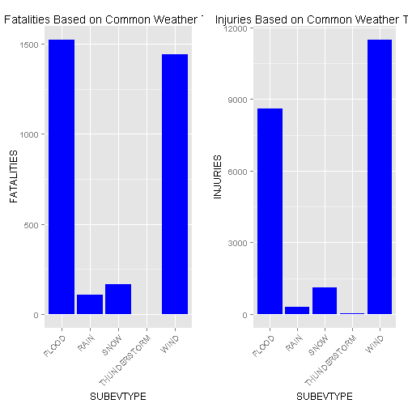
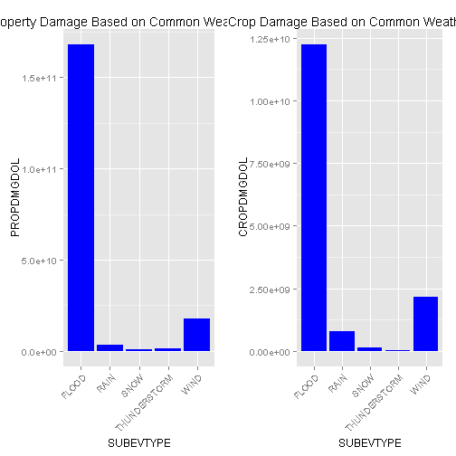

Reproducible Research - Peer Assignment 2
Economic and Health Impacts of Severe Weather Events
========================================================
Created by: Houtsin Diep
Submission date: Oct 26, 2014

# Synopsis

In this report, the data from U.S. National Oceanic and Atmospheric 
Administration's (NOAA) from 1950 - 2011 was analysed to determine the 
population health and economic consequences of various types of weather events.

It was determined that the most common types of weather events over the 
1950-2011 time period were WIND, SNOW, THUNDERSTORM, FLOOD, RAIN. Based on these
types of weather events, the population health effects and economic consequences
are summarised within.


# Source Data and Support Documents Locations:
The data and supporting information for the data is located at the following 
locations:

1. The NOAA database:
(https://d396qusza40orc.cloudfront.net/repdata%2Fdata%2FStormData.csv.bz2)
2. National Weather Service Storm Data Documentation:
(https://d396qusza40orc.cloudfront.net/repdata%2Fpeer2_doc%2Fpd01016005curr.pdf)
3. National Climatic Data Center Storm Events FAQ:
(https://d396qusza40orc.cloudfront.net/repdata%2Fpeer2_doc%2FNCDC%20Storm%20Events-FAQ%20Page.pdf)


# Tool Used (Requirements)

This assignment was completed by leveraging the following applications:

1. RStudio: Created, edited and wrote the analysis for publication to RPubs
2. knitr: Compiled the R Markdown file and converted to HTML


# Data Processing

## Set Working Directory

The working director was set in preparation to read the data.


```r
setwd("~/Rprac/reproducible_research/peer_assessment_2")
```

## Read Data File

Checked if the data has already been loaded and, if not, load the data set into
the session.


```r
if (!"data" %in% ls()) {
    data <- read.csv("repdata-data-StormData.csv.bz2")
}
```

## Subset Data

The raw data was sebsetted into two sets, one for further analysis on the 
population health and one for further analysis on the economic consequences.

Subset the data to focus on population health (evtype (8), fatalities (23), 
injuries (24), state (7))


```r
phdata <- data[,c(8,23,24,7)]
```

Subset the data to focus on economic consequences (evtype (8), propdmg (25), 
propdmgexp (26), cropdmg (27), cropdmgexp (28), state (7))


```r
ecdata <- data[,c(8, 25:28, 7)]
```

## Determining which event types to focus on

Determine the most common types of weather by analysing all the words in the 
event types and finding the most common


```r
phdata.evtype <- (unique(phdata[,1]))
phdata.evtype <- as.character(phdata.evtype)

phdata.evtype.split <- unlist(strsplit(phdata.evtype, c(" ")), recursive = 
                                      FALSE)
phdata.evtype.split <- unlist(strsplit(phdata.evtype.split, c("/")), recursive = 
                                      FALSE)

df <- as.data.frame(phdata.evtype.split, stringAsFactors = 
                            default.stringsAsFactors())
summary(df, 10)
```

```
##    phdata.evtype.split
##  WIND        : 122    
##  SNOW        :  98    
##  WINDS       :  87    
##  HEAVY       :  74    
##  HIGH        :  73    
##  THUNDERSTORM:  73    
##  FLOOD       :  69    
##  Summary     :  59    
##  RAIN        :  56    
##  (Other)     :1815
```

Based on the frequency of words, it looks like WIND, SNOW, THUNDERSTORM, FLOOD, 
RAIN are the most common. These event types was used to analyse both population 
health and economic consequences.

## Subset and apply factor Event Types WIND, SNOW, THUNDERSTORM, FLOOD, RAIN

### For Population Health Data

The PH data was subsetted and a factor variable was created to determine what 
each type of event was. Once the generalized weather event type was created, a 
subset of the data was set for analysis.


```r
subevtype <- c("WIND", "SNOW", "THUNDERSTORM", "FLOOD", "RAIN")

phdata.subevtype <- subset(phdata, grepl(paste(subevtype, collapse = "|"), 
                                         phdata$EVTYPE))
phdata.subevtype$SUBEVTYPE <- phdata.subevtype$EVTYPE
phdata.subevtype$SUBEVTYPE <- as.factor(gsub(".*(wind|snow|thunderstorm|flood|rain).*$",
                                             "\\1", phdata.subevtype$EVTYPE, 
                                             ignore.case = TRUE))

phdata.subevtype <- phdata.subevtype[,c(5,4,2,3)]
```

### For Economic Consequences Data

The EC data was subsetted and a factor variable was created to determine what 
each type of event was. Once the generalized weather event type was created, a 
subset of the data was set for analysis.


```r
ecdata.subevtype <- subset(ecdata, grepl(paste(subevtype, collapse = "|"), 
                                         ecdata$EVTYPE))
ecdata.subevtype$SUBEVTYPE <- ecdata.subevtype$EVTYPE
ecdata.subevtype$SUBEVTYPE <- as.factor(gsub(".*(wind|snow|thunderstorm|flood|rain).*$",
                                             "\\1", ecdata.subevtype$EVTYPE,
                                             ignore.case = TRUE))
```

The magnitude and property damage columns need to be merged in order to 
accurately gauge the dollar impact of the various types of weather event types.

Exploring the magnitude of the property/crop damage (exponent):


```r
table(ecdata.subevtype$PROPDMGEXP)
```

```
## 
##             -      ?      +      0      1      2      3      4      5 
## 228521      1      5      4    179     17      6      3      4     13 
##      6      7      8      B      h      H      K      m      M 
##      3      2      0     12      1      5 243723      2   4799
```

```r
table(ecdata.subevtype$CROPDMGEXP)
```

```
## 
##             ?      0      2      B      k      K      m      M 
## 318785      7     11      1      1      6 157566      0    923
```

For this analysis, we will ignore any values that are not alpha-numeric. 

Next, we will convert the magnitudes to multipliers and multiple by the 
respective damage columns. A new variable for the total value of property and
crop damage was created.


```r
options(scipen = 1)

ecdata.subevtype$PROPEXP[ecdata.subevtype$PROPDMGEXP == "B"] <- 1e+09
ecdata.subevtype$PROPEXP[ecdata.subevtype$PROPDMGEXP == "8"] <- 1e+08
ecdata.subevtype$PROPEXP[ecdata.subevtype$PROPDMGEXP == "7"] <- 1e+07
ecdata.subevtype$PROPEXP[ecdata.subevtype$PROPDMGEXP == "M"] <- 1e+06
ecdata.subevtype$PROPEXP[ecdata.subevtype$PROPDMGEXP == "m"] <- 1e+06
ecdata.subevtype$PROPEXP[ecdata.subevtype$PROPDMGEXP == "6"] <- 1e+06
ecdata.subevtype$PROPEXP[ecdata.subevtype$PROPDMGEXP == "5"] <- 1e+05
ecdata.subevtype$PROPEXP[ecdata.subevtype$PROPDMGEXP == "4"] <- 10000
ecdata.subevtype$PROPEXP[ecdata.subevtype$PROPDMGEXP == "K"] <- 1000
ecdata.subevtype$PROPEXP[ecdata.subevtype$PROPDMGEXP == "3"] <- 1000
ecdata.subevtype$PROPEXP[ecdata.subevtype$PROPDMGEXP == "H"] <- 100
ecdata.subevtype$PROPEXP[ecdata.subevtype$PROPDMGEXP == "h"] <- 100
ecdata.subevtype$PROPEXP[ecdata.subevtype$PROPDMGEXP == "2"] <- 100
ecdata.subevtype$PROPEXP[ecdata.subevtype$PROPDMGEXP == "1"] <- 10
ecdata.subevtype$PROPEXP[ecdata.subevtype$PROPDMGEXP == "0"] <- 1
ecdata.subevtype$PROPEXP[ecdata.subevtype$PROPDMGEXP == ""] <- 1

ecdata.subevtype$PROPEXP[ecdata.subevtype$PROPDMGEXP == "+"] <- 0
ecdata.subevtype$PROPEXP[ecdata.subevtype$PROPDMGEXP == "-"] <- 0
ecdata.subevtype$PROPEXP[ecdata.subevtype$PROPDMGEXP == "?"] <- 0

ecdata.subevtype$PROPDMGDOL <- ecdata.subevtype$PROPDMG * ecdata.subevtype$PROPEXP
```


```r
ecdata.subevtype$CROPEXP[ecdata.subevtype$CROPDMGEXP == "B"] <- 1e+09
ecdata.subevtype$CROPEXP[ecdata.subevtype$CROPDMGEXP == "M"] <- 1e+06
ecdata.subevtype$CROPEXP[ecdata.subevtype$CROPDMGEXP == "m"] <- 1e+06
ecdata.subevtype$CROPEXP[ecdata.subevtype$CROPDMGEXP == "K"] <- 1000
ecdata.subevtype$CROPEXP[ecdata.subevtype$CROPDMGEXP == "k"] <- 1000
ecdata.subevtype$CROPEXP[ecdata.subevtype$CROPDMGEXP == "2"] <- 100
ecdata.subevtype$CROPEXP[ecdata.subevtype$CROPDMGEXP == "0"] <- 1
ecdata.subevtype$CROPEXP[ecdata.subevtype$CROPDMGEXP == ""] <- 1
ecdata.subevtype$CROPEXP[ecdata.subevtype$CROPDMGEXP == "?"] <- 0

ecdata.subevtype$CROPDMGDOL <- ecdata.subevtype$CROPDMG * ecdata.subevtype$CROPEXP
```

A new subset of data was created in order for summary. It contained the 
following columns:

1. General Weather Event Type
2. State
3. Property Damage Value
4. Crop Damage Value


```r
ecdata.subevtype.sub <- ecdata.subevtype[,c(7,6,9,11)]
```

Note: As the raw data was the same for both the economic and personal subsets, 
the focus will remain on the weather that occurs most frequently in the data.

## Summarizing data

### For Population Health Data

Summarize the # of injuries and # of fatalities by subset of the weather event 
types by state.


```r
library(reshape2)
library(gridExtra)

phdata.subevtype_melt <- melt(phdata.subevtype, id = c("SUBEVTYPE", "STATE"))

phdata.subevtype_cast_total <- dcast(phdata.subevtype_melt, SUBEVTYPE ~ 
                                             variable, sum)
phdata.subevtype_cast_state <- dcast(phdata.subevtype_melt, SUBEVTYPE + STATE ~ 
                                             variable, sum)
```


### For Economic Consequences Data

Summarize the # of injuries and # of fatalities by subset of the weather event 
types by state.


```r
ecdata.subevtype_melt <- melt(ecdata.subevtype.sub, id = c("SUBEVTYPE", "STATE"))

ecdata.subevtype_cast_total <- dcast(ecdata.subevtype_melt, SUBEVTYPE ~ variable, sum)
ecdata.subevtype_cast_state <- dcast(ecdata.subevtype_melt, SUBEVTYPE + STATE ~ variable, sum)
```


# Results

## Across the United States, which types of events (as indicated in the EVTYPE 
variable) are most harmful with respect to population health?


```r
library(ggplot2)

plot1 <- ggplot(phdata.subevtype_cast_total, aes(x = SUBEVTYPE, y = FATALITIES)) + 
        geom_bar(stat = "identity", fill = "blue") + 
        theme(axis.text.x = element_text(angle = 45, hjust = 1)) +
        ggtitle("Fatalities Based on Common Weather Types")

plot2 <- ggplot(phdata.subevtype_cast_total, aes(x = SUBEVTYPE, y = INJURIES)) + 
        geom_bar(stat = "identity", fill = "blue") + 
        theme(axis.text.x = element_text(angle = 45, hjust = 1)) +
        ggtitle("Injuries Based on Common Weather Types")

grid.arrange(plot1, plot2, ncol = 2)
```

 
Figure 1

The plots above illustrates the number of fatalities and injuries associated 
with a various types of weather events. The weather event types that can be 
associated with the most fatalities and injuries are flooding and wind.


## Across the United States, which types of events have the greatest economic consequences?


```r
plot1 <- ggplot(ecdata.subevtype_cast_total, aes(x = SUBEVTYPE, y = PROPDMGDOL)) + 
        geom_bar(stat = "identity", fill = "blue") + 
        theme(axis.text.x = element_text(angle = 45, hjust = 1)) +
        ggtitle("Property Damage Based on Common Weather Types")

plot2 <- ggplot(ecdata.subevtype_cast_total, aes(x = SUBEVTYPE, y = CROPDMGDOL)) + 
        geom_bar(stat = "identity", fill = "blue") + 
        theme(axis.text.x = element_text(angle = 45, hjust = 1)) +
        ggtitle("Crop Damage Based on Common Weather Types")

grid.arrange(plot1, plot2, ncol = 2)
```

 
Figure 2

The plots above illustrates the total dollar impact associated with a various 
types of weather events. The weather event type that can be associated with the
highest dollar impact is flooding.


# System Information
This analysis was performed with the following system:


```r
sessionInfo()
```

```
## R version 3.1.0 (2014-04-10)
## Platform: i386-w64-mingw32/i386 (32-bit)
## 
## locale:
## [1] LC_COLLATE=English_United States.1252 
## [2] LC_CTYPE=English_United States.1252   
## [3] LC_MONETARY=English_United States.1252
## [4] LC_NUMERIC=C                          
## [5] LC_TIME=English_United States.1252    
## 
## attached base packages:
## [1] grid      stats     graphics  grDevices utils     datasets  methods  
## [8] base     
## 
## other attached packages:
## [1] knitr_1.7       gridExtra_0.9.1 ggplot2_1.0.0   reshape2_1.4   
## [5] cluster_1.15.2 
## 
## loaded via a namespace (and not attached):
##  [1] colorspace_1.2-4 digest_0.6.4     evaluate_0.5.5   formatR_1.0     
##  [5] gtable_0.1.2     labeling_0.3     markdown_0.7.4   MASS_7.3-31     
##  [9] mime_0.2         munsell_0.4.2    plyr_1.8.1       proto_0.3-10    
## [13] Rcpp_0.11.3      scales_0.2.4     stringr_0.6.2    tools_3.1.0
```
